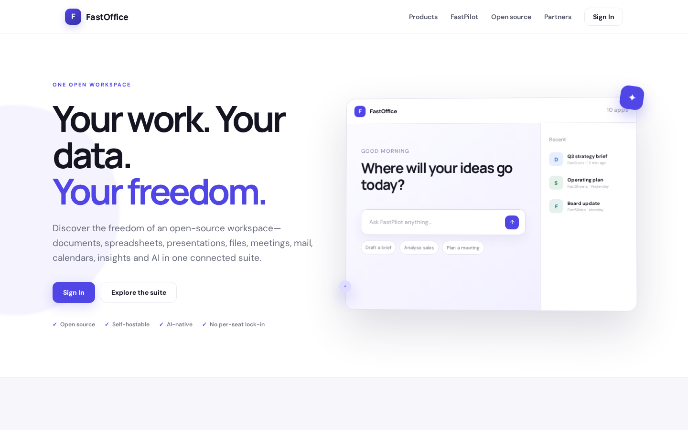
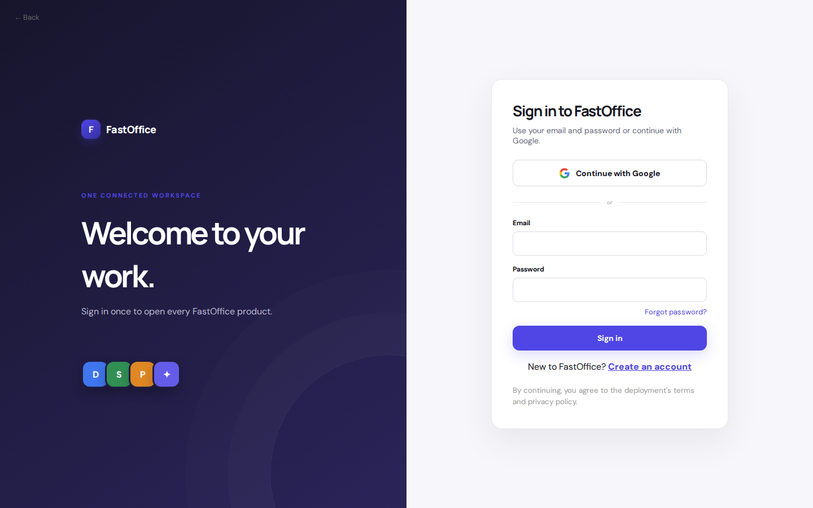

# FastOffice Platform Guide

**Published:** 2026-08-19
**Platform:** [https://office.fastsme.com](https://office.fastsme.com)
**Source:** [github.com/predictivelabsai/FastOffice](https://github.com/predictivelabsai/FastOffice)

## Platform overview

FastOffice is the open-source productivity suite and control plane for FastDocs, FastSheets, FastSlides, FastDrive, FastMeet, FastInsights, FastMail, FastCalendar, and FastPilot.

This visual guide was reviewed against the live product using Playwright. Screens and available navigation can vary by account, role, and deployment configuration.

## 1. Your work. Your data. Your freedom.

ONE OPEN WORKSPACE Your work. Your data. Your freedom. Discover the freedom of an open-source workspace—documents, spreadsheets, presentations, files, meetings, mail, calendars, insights and AI in one connected suite. Sign In Explore the suite Open source Self

Screen reviewed at: [https://office.fastsme.com/](https://office.fastsme.com/)

## 2. Welcome to your work.

← Back F FastOffice ONE CONNECTED WORKSPACE Welcome to your work. Sign in once to open every FastOffice product. D S P ✦ Sign in to FastOffice Use your email and password or continue with Google. Continue with Google or Email Password Forgot password? Sign in

Screen reviewed at: [https://office.fastsme.com/login](https://office.fastsme.com/login)

## 3. Welcome to your work.

← Back F FastOffice ONE CONNECTED WORKSPACE Welcome to your work. Sign in once to open every FastOffice product. D S P ✦ Sign in to FastOffice Use your email and password or continue with Google. Continue with Google or Email Password Forgot password? Sign in

Screen reviewed at: [https://office.fastsme.com/login?next=/pilot](https://office.fastsme.com/login?next=/pilot)

## 4. Welcome to your work.

← Back F FastOffice ONE CONNECTED WORKSPACE Welcome to your work. Sign in once to open every FastOffice product. D S P ✦ Sign in to FastOffice Use your email and password or continue with Google. Continue with Google or Email Password Forgot password? Sign in

Screen reviewed at: [https://office.fastsme.com/login](https://office.fastsme.com/login)

## Getting started

Visit [https://office.fastsme.com](https://office.fastsme.com) to explore FastOffice. For source code and deployment details, use the GitHub link above.
